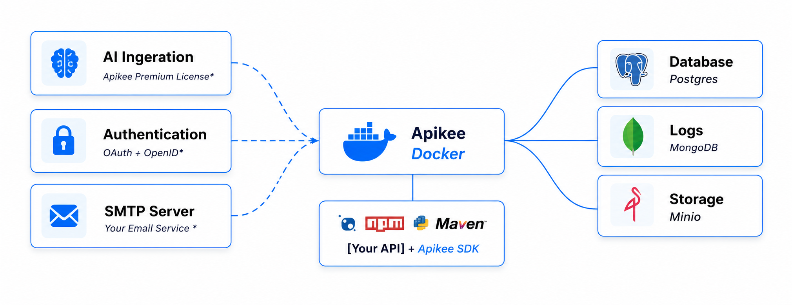

# Apikee

Apikee is an API key platform for building and securing products across multiple runtimes. This organization hosts the open-source Apikee codebase and the four public SDK package codebases that integrate with it.

## Open-source codebases

The public repositories in this workspace are:

- [Apikee codebase](../apikee) | [website](../web) - the product-facing web codebase.
- [Node.js SDK](../node) | [npm](https://www.npmjs.com/package/apikee) - Express, Fastify, and Hono support.
- [Python SDK](../python) | [PyPI](https://pypi.org/project/apikee/) - FastAPI, Flask, and ASGI support.
- [.NET SDK](../dotnet) | [NuGet](https://www.nuget.org/packages/Apikee/) - ASP.NET Core middleware and Swagger support.
- [Java SDK](../java) | [Maven Central](https://central.sonatype.com/artifact/dev.apikee/apikee-spring) - Spring Boot autoconfiguration and SpringDoc support.

The other workspace projects are part of the broader Apikee product and infrastructure, but they are not open source.

## Architecture

The diagram below shows how the public Apikee surface fits into the larger system.

In short:

- The SDKs let your API create and verify Apikee keys locally.
- The Apikee runtime sits in Docker and coordinates product behavior.
- Internal services handle licensing, identity, email delivery, data persistence, logging, and file storage.

## References

- [Apikee docs](https://apikee.com/docs) - product documentation, including OAuth and OpenID integrations.
- [AI Premium License](https://apikee.com/billing/upgrade?plan=premium) - premium AI licensing and upgrade flow.
- [Docker image source](../apikee/Dockerfile) - the container definition for the Apikee runtime.

## Contributing

Contributions are welcome. If you want to help, start with the repository-specific contribution guide in the project you are working on, open an issue before larger changes, and keep pull requests focused.

If you are contributing to one of the public SDKs, please match the style and conventions already used in that package, add tests when behavior changes, and keep the public API stable unless a breaking change is clearly justified.